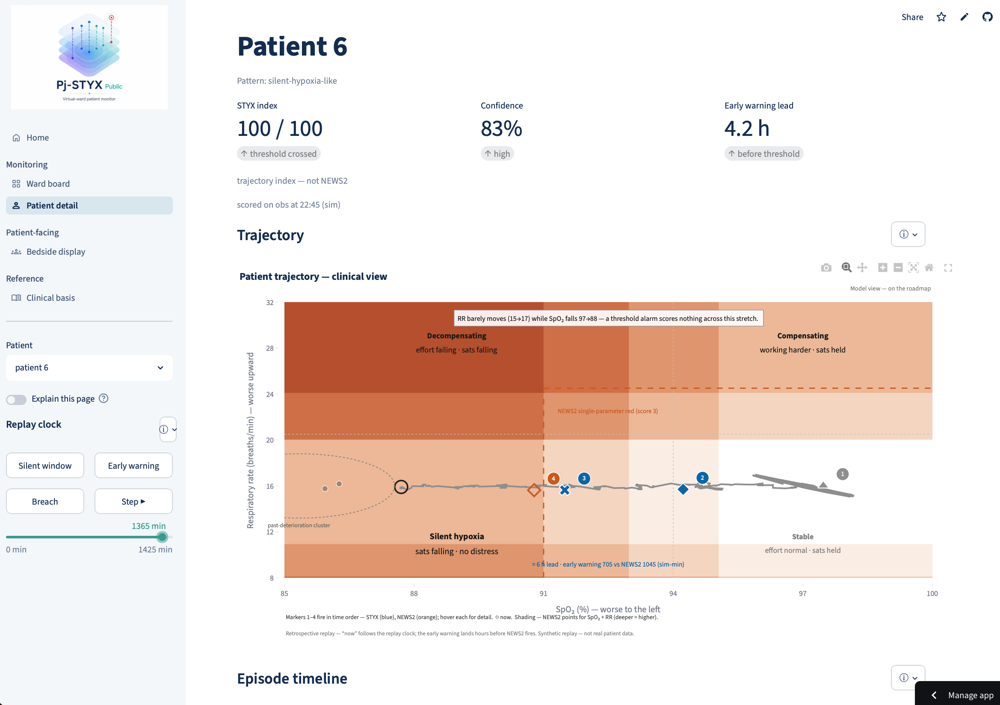
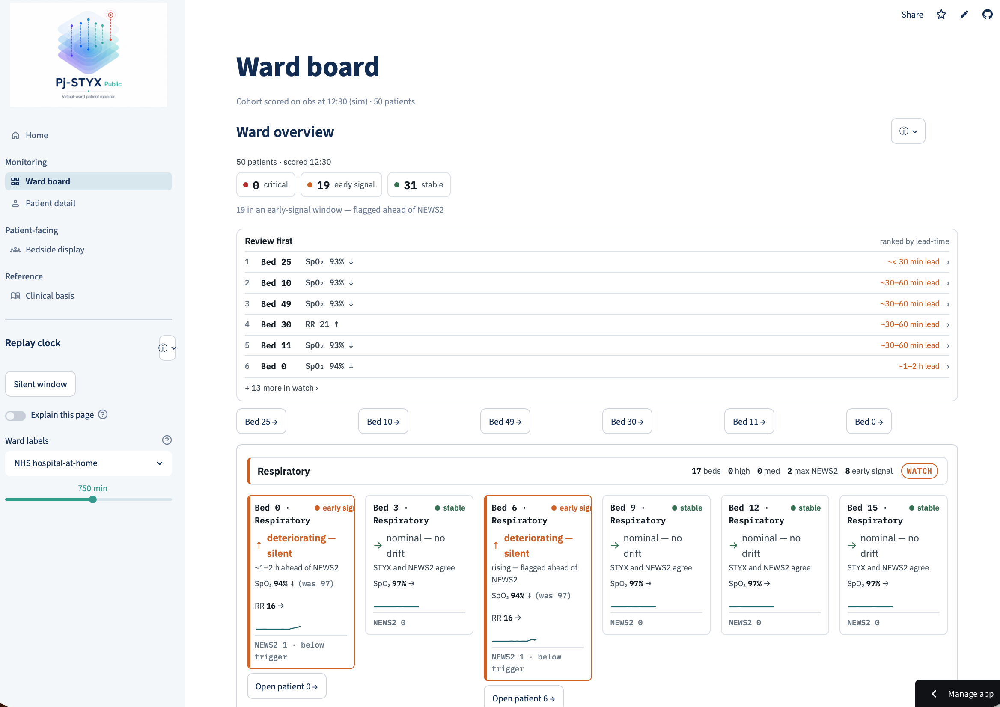

# STYX

A virtual-ward physiological-trajectory monitor (Virtual Wards hackathon,
Challenge 3, considerate of Challenge 2) — **in support of nurse-led NEWS2, never a
replacement.** STYX renders each patient's telemetry as a path through a learned
state space and re-scores it every 15 simulated minutes against *that patient's own
baseline* across RR, SpO₂, HR and Temp — surfacing the patient who still looks well
on today's numbers but is drifting toward deterioration, and flagging them *before*
an absolute threshold is crossed. It also folds in the patient's lifelong care
history — GP, A&E, admissions and the rest as a single timeline. Logic lives in the
importable `styx/` package; `app/` (Streamlit + Plotly) and `notebooks/` are thin
clients of it.

In the synthetic replay, STYX surfaces silent-hypoxia drift up to about five hours
ahead of NEWS2's red score on the clearest case, and flags 19 patients across the
ward in an early-signal window — and the lead holds *even when NEWS2 is scored on the
same continuous data*, so it comes from reading the trajectory, not from scoring more
often. (The modelled condition is acute respiratory infection / pneumonia-style
silent hypoxia, scored on NEWS2 Scale 1. Lead times are illustrative on synthetic
data — see the in-app **Clinical basis** page for scope and limits.)

## Live demo

**[Open the STYX demo](https://pj-styx.streamlit.app)**
&nbsp;·&nbsp; `https://pj-styx.streamlit.app`

> **The demo is a replay of synthetic data — no real patients, not a live or
> streaming deployment, and not a validated tool or a medical device.** Lead times
> shown are illustrative. "No alert" means *review as normal*, never *safe*; a
> clinician reviews everything and nothing auto-escalates. The deployment target
> (A3) is described in the docs; the MVP serves an A2 windowed re-score over replay.

## Screenshots


| Patient view | Ward board |
|---|---|
|  |  |
| Patient hero — trajectory, forecast cone, risk waterline, and the care-event overlay. | Cohort triage ranked by time-to-escalation, with risk heat-strips. |

## Views

The app (sidebar nav, in workflow order) is five thin clients of `styx/`:

- **Home** — the one-glance front page: bottom line, impact, effect, and the
  obs-timeline motif ("NEWS2 scores at the obs. STYX watches in between").
- **Ward board** — cohort triage on the shared replay clock: an overview strip, a
  ranked review-now worklist, and physical bed bays. NEWS2 band is each bed's primary
  signal; the STYX trend rides the sparkline.
- **Patient detail** — the trajectory-and-care-history hero: state-space trajectory,
  risk waterline, forecast cone, the NEWS2 A/B comparator, history-as-prior survival,
  and a plain-language rationale naming the signals most driving the score.
- **Bedside display** — a patient- and carer-safe surface: a calm status and a plain
  reason, with no scores, codenames, or "breach/escalation" language.
- **Clinical basis** — what STYX is grounded in: NEWS2 Scale 1 scoring, what it reads,
  what it cannot see (no BP, no consciousness level), scope, limits, glossary, and
  references.

## Run locally

```bash
pip install -e .            # editable install of the styx package
streamlit run app/app.py    # launch the demo UI
pytest                      # run tests / gate checks
```

## Deploy to Streamlit Community Cloud

1. Push this repo to GitHub.
2. Go to [share.streamlit.io](https://share.streamlit.io) → **New app**.
3. Pick the repo and branch, and set **Main file path** to `app/app.py`.
4. **Deploy.** Dependencies install from the existing `pyproject.toml`
   (`numpy`, `scipy`, `scikit-learn`, `lifelines`, `streamlit`, `plotly`,
   `jupytext`).
5. Copy the resulting URL into the [Live demo](#live-demo) section above.

Notes:

- `.streamlit/config.toml` already sets `toolbarMode = "minimal"`, which hides the
  Deploy button — correct for a public, replay-of-synthetic demo.
- If Cloud can't resolve dependencies from `pyproject.toml`, add a
  `requirements.txt` mirroring the deps above (optional fallback).

## Embed on a website

Drop the hosted app into any page with an iframe and the `?embed=true` flag:

```html
<iframe src="https://pj-styx.streamlit.app/?embed=true"
        width="100%" height="800" style="border:none;"></iframe>
```

- Tune the chrome with `?embed=true&embed_options=show_toolbar` (or
  `disable_scrolling`, `light_theme`, `dark_theme`).
- Keep the **synthetic-data, not-a-live-deployment** disclaimer visible on the host
  page too — the demo must never imply real patient data.

## Data-science notebooks

All notebooks are consumers of the **seed-42 synthetic cohort** — they never touch the
synth engine or re-baseline the determinism digest; any model/split RNG is
notebook-local and separately seeded. They share one honesty spine: synthetic data is
generated from a known process, so anything fit on it looks near-perfect in-sample (the
construct artifact behind the telemetry AUC of 1.000). **They demonstrate method, not
performance** — the real test is the identical pipeline on real data, which the roadmap
notebooks are a dress rehearsal for, never a substitute. Sources are jupytext
`py:percent` (the paired `.ipynb` is generated on run, not committed); each is
deterministic and restart-run-all clean, with the canonical numbers asserted inline so
it fails loudly on drift.

### Built

- **[`notebooks/10_how_styx_predicts.py`](notebooks/10_how_styx_predicts.py)** — the
  visual mechanism walkthrough (the "watch it work" demo asset). Thirteen sections take
  the index patient, then the cohort, through every layer: raw signal → NEWS2-over-time
  → state space → decoupling → the personal-baseline early warning → forecast cone →
  risk index → the assembled cascade → the plain-language rationale → cohort → a "what
  these numbers aren't" saturation cell → limits.
  Three-register explainer (plain for a clinician, dev for an engineer, tech for a data
  scientist) on every section.
- **[`explorers/E3_time_to_event.py`](explorers/E3_time_to_event.py)** — "when, not
  whether": reframes the readout from a binary risk flag to a **calibrated
  time-to-escalation** (survival analysis), targeting the clinical NEWS2-red trigger
  (independent of STYX's own line). It finds the reframe is *sound* — predicting **when**
  (Cox C-index ≈ 0.915) is a real, non-saturating target where predicting **whether**
  saturates (AUC 1.000) — but the per-patient estimate is **not yet deployable**:
  calibration is poor per subgroup in-sample, and the compensated pattern *under-warns*
  (predicts later than it happens). Verdict: **conditional adopt**, blocked on
  per-subgroup calibration and real-data validation. The §5 card is an honest
  illustration, not a shippable readout.

### Roadmap

- **`11_learning_pipeline.ipynb`** — the supervised train / validate / test rehearsal:
  how STYX (today *mechanistic, not learned*) *would* learn from real data, done properly
  — schema mirroring a real wearable / MIMIC-style source → patient-level split →
  leakage-audited features → glass-box model → AUROC/CI, sens/spec, PPV/NPV, calibration
  → a held-out test run once → the honesty checkpoint.
- **`12_validation_assurance.ipynb`** — the assurance harness for the roadmap
  non-negotiables: subgroup / fairness with an explicit pulse-oximetry skin-tone bias
  injection (the cell that matters most — that bias bites exactly where the
  silent-hypoxia thesis lives), calibration + threshold-by-clinical-cost, alert-burden /
  false-positive curves, drift across reseeded cohorts, and a DCB0129 evidence map.
  (Needs NB2's model + split.)
- **Explorers** ([`docs/STYX_explorer_notebooks.md`](docs/STYX_explorer_notebooks.md)) —
  focused "what if" studies, each stating up front what synthetic data can and cannot
  settle. E3 (above) is built; **E1** (do the constructed state-space axes earn their
  keep?), **E2** (what richer wearable signals would add), and **E4** (a fairer,
  nurse-skill comparator) remain, ordered by how much synth can honestly answer.

The walkthrough (NB1) is the demo; the learning + assurance notebooks (NB2/NB3) are the
answer to "this is unvalidated — why trust the approach?" — they show real validation is
understood and the rehearsal harness already built, with caveats stated honestly
throughout. The explorers probe specific design questions; E3's conditional-adopt verdict
is the template for how they report — a clear finding, honestly bounded.

## Where to look

- `BUILD_MVP.md` — the S0→S7 build order, gates, and proof notebooks.
- `CLAUDE.md` — hard rules and architecture constraints.
- `docs/` — PRD (`STYX_PRD.md`), feature verdict, serving-architecture red-team.
- `EXPERIMENT_LOG.md` — append-only per-slice results.
