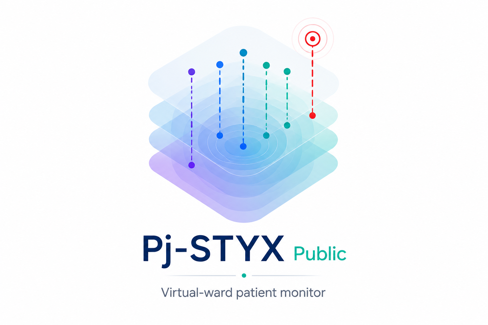

# STYX

A virtual-ward physiological-trajectory monitor (Virtual Wards hackathon,
Challenge 3). STYX renders each patient's telemetry as a path through a learned
state space, anticipates deterioration *before* threshold breach, and integrates
the patient's care history (Theograph). Logic lives in the importable `styx/`
package; `app/` (Streamlit + Plotly) and `notebooks/` are thin clients of it.

## Live demo

**[Open the STYX demo](https://pj-styx.streamlit.app)**
&nbsp;·&nbsp; `https://pj-styx.streamlit.app`

> **The demo is a replay of synthetic data — no real patient data, and not a live
> or streaming deployment.** The deployment target (A3) is described in the docs;
> the MVP serves an A2 windowed re-score over replay.

## Screenshots



| Patient view | Ward board |
|---|---|
|  |  |
| STYX × Theograph hero: trajectory, forecast cone, risk waterline, event overlay. | Cohort triage ranked by time-to-escalation, with risk heat-strips. |

> _Screenshots are placeholders._ Capture them from the running app
> (`streamlit run app/app.py` → Patient view + Ward board) and save to
> `docs/img/`. A short GIF of the replay scrubber makes a strong README hero.

## Run locally

```bash
pip install -e .            # editable install of the styx package
streamlit run app/app.py    # launch the demo UI
pytest                      # run tests / gate checks
```

## Deploy to Streamlit Community Cloud

1. Push this repo to GitHub.
2. Go to [share.streamlit.io](https://share.streamlit.io) → **New app**.
3. Pick the repo and branch, and set **Main file path** to `app/app.py`.
4. **Deploy.** Dependencies install from the existing `pyproject.toml`
   (`numpy`, `scipy`, `scikit-learn`, `lifelines`, `streamlit`, `plotly`,
   `jupytext`).
5. Copy the resulting URL into the [Live demo](#live-demo) section above.

Notes:

- `.streamlit/config.toml` already sets `toolbarMode = "minimal"`, which hides the
  Deploy button — correct for a public, replay-of-synthetic demo.
- If Cloud can't resolve dependencies from `pyproject.toml`, add a
  `requirements.txt` mirroring the deps above (optional fallback).

## Embed on a website

Drop the hosted app into any page with an iframe and the `?embed=true` flag:

```html
<iframe src="https://pj-styx.streamlit.app/?embed=true"
        width="100%" height="800" style="border:none;"></iframe>
```

- Tune the chrome with `?embed=true&embed_options=show_toolbar` (or
  `disable_scrolling`, `light_theme`, `dark_theme`).
- Keep the **synthetic-data, not-a-live-deployment** disclaimer visible on the host
  page too — the demo must never imply real patient data.

## Where to look

- `BUILD_MVP.md` — the S0→S7 build order, gates, and proof notebooks.
- `CLAUDE.md` — hard rules and architecture constraints.
- `docs/` — PRD (`STYX_PRD.md`), feature verdict, serving-architecture red-team.
- `EXPERIMENT_LOG.md` — append-only per-slice results.
